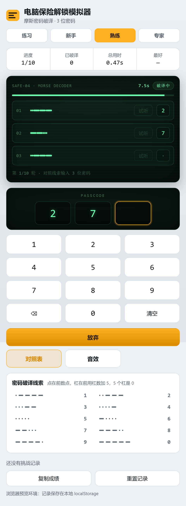
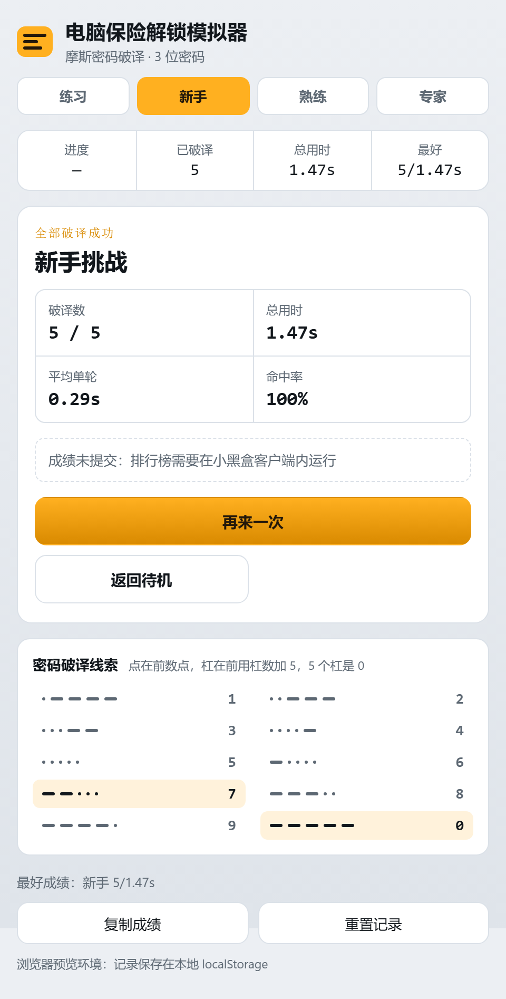

# 三角洲电脑保险解锁模拟器

小黑盒工坊小程序。还原《三角洲行动》「电脑保险」的破译终端：屏幕上给出 3 行摩斯密码，
每行对应密码的一位数字，对照摩斯数字表把 3 位密码敲进键盘，越快越好。





## 玩法

| 模式 | 轮数 | 单轮限时 | 计入成绩 | 排行榜 |
| --- | --- | --- | --- | --- |
| 练习 | 1 | 不限 | ❌ | — |
| 挑战 | 15 | 5 秒 | ✅ | 挑战排行榜 |

难度按钮在标题右边共处一行，只有练习与挑战两个。

- **练习**：单次破译。结束后**停在结果页**，摩斯、正确答案与本次用时都留在屏幕上，
  由用户点「再来一次」继续，方便回看成绩。HUD 显示本次会话的累计（已破译台数、累计用时、
  最快单次），**只存在内存里，离开练习模式或关闭页面即清空**，不写 storage 也不写榜单。
- **挑战**：连续 15 轮，每轮 3 位密码，输满自动判定；答对累计破译数，答错或超时不计破译数并
  短暂揭晓正确答案，然后自动进入下一轮（挑战不中断）。全部轮次结束后出结算页并提交榜单。
- 排行榜按 **破译数优先、总时间次之** 排序；总时间累计挑战内所有轮次，
  含答错与超时的轮次，所以失误是有代价的。
- 数字键盘输入，输满 3 位自动判定；实体键盘 `0-9` / `Backspace` / `Enter` 同样可用。
- 每轮密码的 3 位数字**互不相同**（`randomCode()` 用不放回抽样，`src/morse.js`）：
  重复位会让两行摩斯长得一模一样，玩家发现「这两行一样」就白送一位线索，等于稀释难度。
  不放回抽样的另一个好处是不需要「随机到不重复为止」的循环重试。可能的密码因此从 1000 种
  收敛到 720 种，但玩家是靠译码而不是穷举，实际难度不受影响。
- 对照表（密码破译线索）常驻显示，与游戏一致：图案在左、数字在右，顺序 1-9 再 0。
- 每行摩斯有「试听」按钮，可随时听这一行的滴答声。

> **音效按钮暂时下线。** 原先开启音效后需要在播报期间禁用键盘，但玩家可以直接盯着屏幕把密码
> 记下来，等于绕过了听力考核，不科学。后续会做成「仅音效」的独立排行榜模式（隐藏摩斯图案、
> 键盘全程可用），在那之前不暴露音效入口。`src/morse.js` 里的播放器与 `playMorseSequence()`
> 保留给那个模式复用。

摩斯数字规则：点在前数点（5 个点是 5），杠在前用杠数加 5（1 个杠是 6、4 个杠是 9），
5 个杠是 0。

## 排行榜

榜单只有一个数值 `score` 参与排序，`extra` 不参与排序，所以两项被编码进一个数：

```
score = 破译数 × 1_000_000 + (1_000_000 − 总毫秒)      order = desc
```

破译数多者恒胜出，破译数相同时总时间短者胜；`extra` 里另存 `{ solved, totalMs }` 供展示，
读不到时回退到解码 `score`。

### 昵称怎么来的

`getList()` 只给出不透明的 `appUserId`，平台**没有**「用 appUserId 反查别人资料」的接口，
所以榜单上别人的昵称只能由各人自己在提交成绩时写进 `extra`：

```
extra = { solved, totalMs, nickname }      // nickname ≤ 20 字
```

`user.getInfo()`（需声明 `userInfo` 权限，声明即可用、无需平台批准）静默读取当前用户的
`profile.nickname`，结果在会话内缓存，失败不缓存以便下次重试。资料读取失败时只提交成绩，
不影响主流程。

榜单每行的昵称按这个顺序取：

| 情况 | 显示 |
| --- | --- |
| 自己那行，实时资料有昵称 | 实时昵称（**不吃 `extra` 的冻结**，见下） |
| 自己那行，实时资料取不到但记录里有 | 记录里的昵称 |
| 自己那行，两边都没有 | `我` |
| 别人那行，记录里有 | 记录里的昵称 |
| 别人那行，记录里没有 | `玩家 + appUserId 前 6 位` |

> **`extra` 只在成绩更优时更新。** 所以「改了昵称要等下次破纪录才同步」和「旧记录里根本没存
> 昵称」都会发生。为了让自己的行不被这条规则卡住，自己那行优先用实时资料。
> 别人的行做不到——除非用 `deleteCurrentUserEntry()` 删掉再同分重提做迁移（会短暂掉榜，
> 并影响同分记录的先后），故未实现。

昵称取不到时，状态行会显式写出原因（例如「昵称未取到（未登录小黑盒账号）」），
不会只剩一个「我」让人猜。

页面下方**常驻显示当前难度的排行榜前 50**：切换难度即切换榜单，练习模式没有榜单、面板自动收起，
右上角「刷新」可手动重读。自己上榜的那条会高亮并带「我」标记，上方还有一行「我的最好成绩」。

> 宿主对榜单读请求有 5 分钟缓存。刚提交完成绩会立刻刷新到最新名次，但**别人的成绩更新可能有延迟**，
> 点「刷新」也不一定立刻看到——这是平台行为，不是页面没刷新。

榜单需要先用 CLI 为当前小程序创建（已创建，新增环境时重跑即可）：

```bash
npm run hb-sdk -- remote cloud leaderboard create expert_challenge --order desc --rank-limit 500
```

> 模式从「新手 / 熟练 / 专家」三档收敛成「练习 / 挑战」后，**只用到 `expert_challenge`**。
> 早先创建的 `novice_challenge`、`skilled_challenge` 仍留在服务端，页面已不再读写；
> 要清理可以走 `remote cloud leaderboard delete`。本地记录侧不用管——`normalizeRecord()`
> 只保留 `CHALLENGE_ORDER` 里还有的 id，被删掉的两档记录下次存盘时自动消失。

## 命令

> **Node.js 需要 ≥ 22.20.0。** 这是 hb-sdk 的硬性要求：它依赖的 `undici@7` 使用了 Node 20+
> 才有的全局 `File`，Vite 8 也要求 Node 20.19+ / 22.12+。在 Node 18 上 CLI 大部分命令能跑通
> （登录、`remote create`/`bind`、`build`），但 `hb-sdk dev` 会直接报 `File is not defined`。
> 用 `node -v` 确认版本。

```bash
npm install
npm run hb-sdk -- login
npm run hb-sdk -- remote create
# 已有远端小程序时改用：npm run hb-sdk -- remote bind <mini-program-id>
npm run dev
npm run build
npm run deploy -- --release-note "更新说明"
```

`hb-sdk` 没有全局安装，所有 CLI 调用都要走 `npm run hb-sdk -- <子命令>`。

## 项目声明

`package.json#heybox` 中声明了：

- `name` / `icon` / `coverImages`：`assets/icon.png`（200×200）与 `assets/cover.png`（960×540）。
- `permissions`：`userInfo`（读当前用户昵称头像）、`storage`（本地记录）、`leaderboard`（云端排行榜）。
  三者都只需声明，不需要平台批准。只声明真正用到的能力。
- `window`：PC 开窗默认 480×880，最小 360×620，允许用户拖拽缩放。
- `platforms`：移动端与桌面端六个平台都写在里面，方便桌面调试入口出现。
  **发布前请按实际完成验收的平台裁剪这个数组**，未适配的平台应移除。

## 布局与安全区

宿主的小程序 WebView 是**沉浸式**的：页面从窗口第一行像素开始，状态栏、右上角的
悬浮按钮、底部手势条都压在页面上。所以顶部避让不能只靠 CSS 的 `env(safe-area-inset-*)`
——桌面调试台里它恒为 0 ——必须问宿主拿几何信息。

`src/viewport.js` 启动时调 `viewport.getWindowInfo()`（免声明、免授权、免登录），把
`statusBarHeight` 与 `safeArea`（四个字段是**边界坐标**，右侧和底部要自己做减法）
换算成 `--safe-top` / `--safe-right` / `--safe-bottom` / `--safe-left` 写进 `:root`，
`styles.css` 一律用 `max(env(...), var(--safe-*))` 取两者较大值。读不到时什么都不写，
退回 `env()` 兜底。PC 窗口能被用户拖拽，所以尺寸变化时会防抖重读一次。

右上角那组「更多 / 分享」按钮是宿主自己浮的，页面关不掉，只能让开。平台没有公开它的
尺寸，取值来自调试台绘制同一组按钮时的实现：`top = 状态栏 + 6`、`87 × 32`、右边距 `7`。
顶栏与它**同处一行**，所以横纵都要避让：

```
--host-actions-band: 38px     纵向：状态栏之下需要让开的高度（6 + 32）
--host-actions-width: 94px    横向：右侧整块留空（87 + 7）

.topbar { min-height: var(--host-actions-band); padding-right: var(--host-actions-width) }
```

`min-height` 保证这一行本身就盖过整个悬浮区，于是后面的 HUD、终端屏幕必定在它下方；
`padding-right` 把难度按钮挡在悬浮按钮左边。**代价是顶栏的文字必须在预算内**——
最小窗口 360px 下留给「图标 + 文案 + 两个难度」只有 234px，所以标题压到 4 个字、
副标题压到 6 个字（`.brand__text` 也带省略号兜底）：

| 窗口 | 顶栏需要 | 可用 | 余量 |
| --- | --- | --- | --- |
| 440px | 231px | 314px | 83px |
| 390px | 224px | 264px | 40px |
| 360px（最小） | 224px | 234px | 10px |

改标题或加难度档位前先按这张表算一遍，超了就会挤成省略号。

## 目录结构

```
index.html            页面结构（HUD / 终端屏幕 / 密码显示区 / 键盘 / 结算页 / 对照表）
src/morse.js          摩斯数字表、编解码、Web Audio 播放器
src/challenge.js      两种模式配置、榜单分数编解码、成绩比较
src/leaderboard.js    cloud.leaderboard 封装与错误降级
src/viewport.js       宿主安全区与悬浮按钮避让 → CSS 变量
src/main.js           挑战流程、计时、本地记录、结算与提交
src/styles.css        终端屏幕与页面样式
assets/               小程序图标、封面与顶栏标识
docs/                 运行截图
```

顶栏标识 `assets/delta-mark.png` 是**自绘**的：深色圆角底 + 绿色三角 + 琥珀横条，
和 `assets/icon.png` 同一套图形（三角指向「三角洲」，横条呼应解锁）。两个文件都是用
sharp 把一段 SVG 渲染成 PNG，生成脚本一次性、不入库。**刻意没有使用《三角洲行动》的
官方 logo**——平台《小程序工坊上架规则》第二条要求图片、商标/特定标识、游戏资源都必须
有合法来源，第十二条明确禁止使用第三方权益人的图标，用官方标识需要授权才合规。

## 已知边界

- 音效依赖宿主 WebView 的 Web Audio。取不到 AudioContext 或调度异常时会静默降级为无声，
  不会阻塞回合——音效只是观感增强。
- 本地记录通过 `storage` 按小程序身份隔离持久化；宿主不支持该能力（例如纯浏览器预览）时
  回退到 `localStorage`，页脚会给出提示。
- 排行榜不可用时（未登录、不在小黑盒客户端内、榜单未创建）只影响提交与榜单展示，
  挑战流程与本地记录照常工作，结算页会说明具体原因。

更多内容见 [CLI 指南](https://docs.xiaoheihe.cn/hb_sdk/guide/cli) 和 [SDK 文档](https://docs.xiaoheihe.cn/hb_sdk/)。
